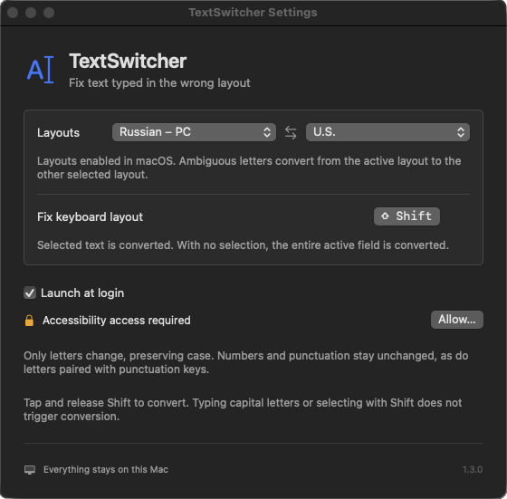

# TextSwitcher

A fully local macOS menu bar app that fixes text typed in the wrong keyboard layout: `Руддщ Цщкдв!` → `Hello World!`.



- Tap **Shift** to convert selected text. With no selection, the app converts the entire active text field.
- Shift used for typing or selecting text does not trigger conversion. You can also assign a different shortcut.
- Choose any two keyboard layouts enabled in macOS. Mappings come from the actual system layouts, including alternative and custom layouts.
- Unambiguous letters convert in either direction. When letters have conflicting mappings, the active selected system layout determines the direction.
- Letter case is preserved. Numbers, punctuation, emoji, and letters paired with punctuation keys stay unchanged.
- Optional launch at login. No accounts, analytics, network requests, or external dependencies.
- Interface follows macOS language preferences: English, Russian, Ukrainian, German, French, Spanish, Italian, Portuguese, Polish, Japanese, Korean, and Simplified or Traditional Chinese. English is the fallback.

## Build & run

Requires **macOS 13+** and the Swift 6 toolchain (Xcode Command Line Tools).

```sh
swift test
zsh scripts/build.sh
mkdir -p ~/Applications
ditto dist/TextSwitcher.app ~/Applications/TextSwitcher.app
open ~/Applications/TextSwitcher.app
```

Allow TextSwitcher in **System Settings → Privacy & Security → Accessibility**. Settings are available from its menu bar icon.

The app temporarily uses and restores the clipboard. Rich text formatting may change, and some custom editors may not be supported. Local builds are signed ad hoc; rebuilding may require granting Accessibility access again.

Composition-based input methods, such as Chinese and Japanese IMEs, are not supported. Conversion uses ordinary, Shift, and Caps Lock keys; Option-only characters and dead-key compositions are left unchanged.

[Usage and implementation notes (Russian)](docs/usage.md)
