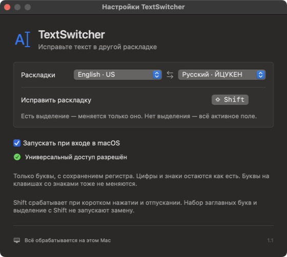

# TextSwitcher

A fully local macOS menu bar app that fixes text typed in the wrong keyboard layout: `Ghbdtn Vbh` → `Привет Мир`.



- Tap **Shift** to convert selected text. With no selection, the app converts the entire active text field.
- Shift used for typing or selecting text does not trigger conversion. You can also assign a different shortcut.
- Choose two layouts: English US, Russian, Ukrainian, or Greek. The two layouts must use different alphabets.
- Letter case is preserved. Numbers, punctuation, emoji, and letters paired with punctuation keys stay unchanged.
- Optional launch at login. No accounts, analytics, network requests, or external dependencies.

## Build & run

Requires **macOS 13+** and the Swift 6 toolchain (Xcode Command Line Tools).

```sh
swift test
zsh scripts/build.sh
mkdir -p ~/Applications
ditto dist/TextSwitcher.app ~/Applications/TextSwitcher.app
open ~/Applications/TextSwitcher.app
```

Allow TextSwitcher in **System Settings → Privacy & Security → Accessibility**. Settings are available from its menu bar icon.

The app temporarily uses and restores the clipboard. Rich text formatting may change, and some custom editors may not be supported. Local builds are signed ad hoc; rebuilding may require granting Accessibility access again.

[Usage and implementation notes (Russian)](docs/usage.md)
